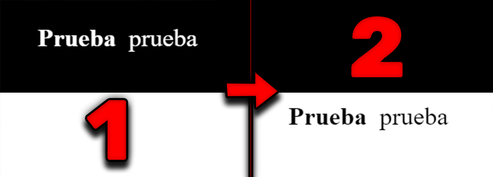

# Cambio de Colores del Encabezado Según la Sección

> **Error:** Falta calibrar cuándo cambia de color.

[!error]
Falta calibrar cuándo cambia de color.

`Error: Falta calibrar cuándo cambia de color.`

  <strong>Error:</strong> Falta calibrar cuándo cambia de color.

!!! warning "Título"
    Este es un mensaje de advertencia con un título.

    :::note
Esto es una nota.

[NOTE]
====
Esto es una nota.
====
